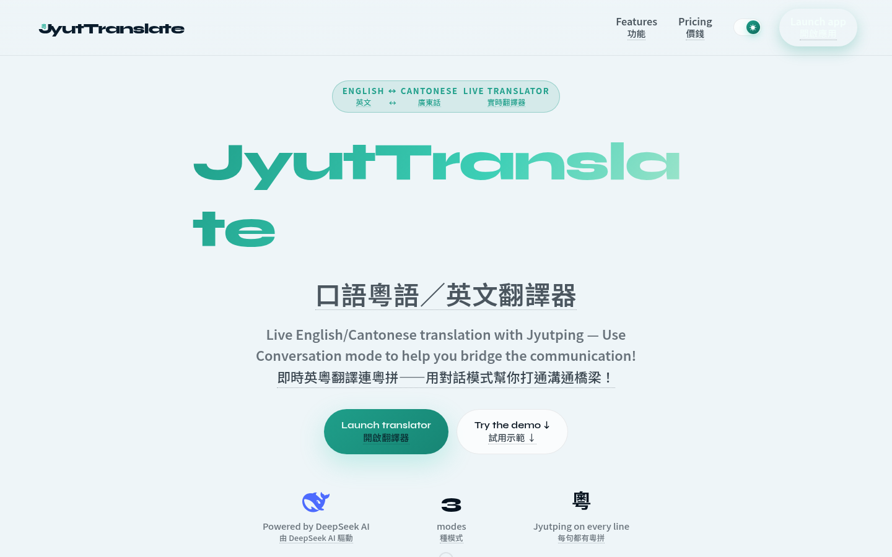
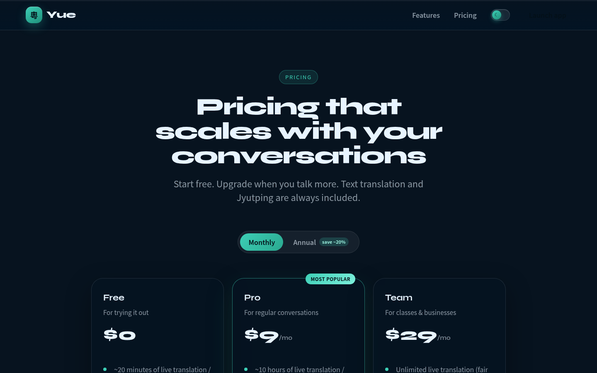
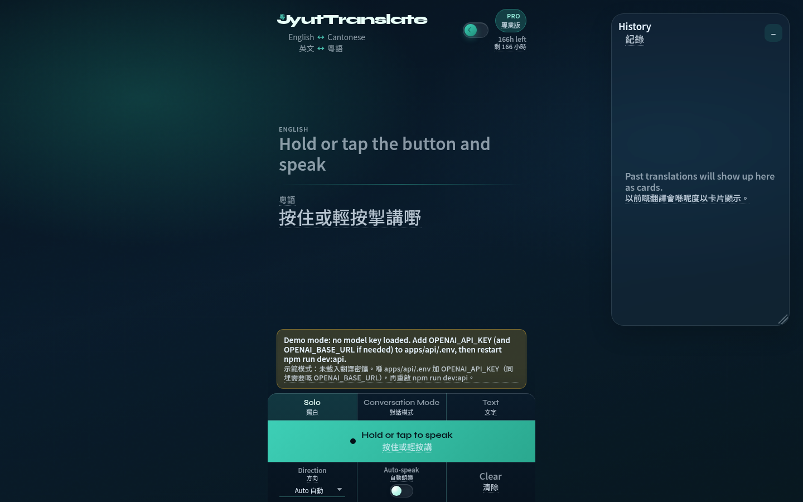
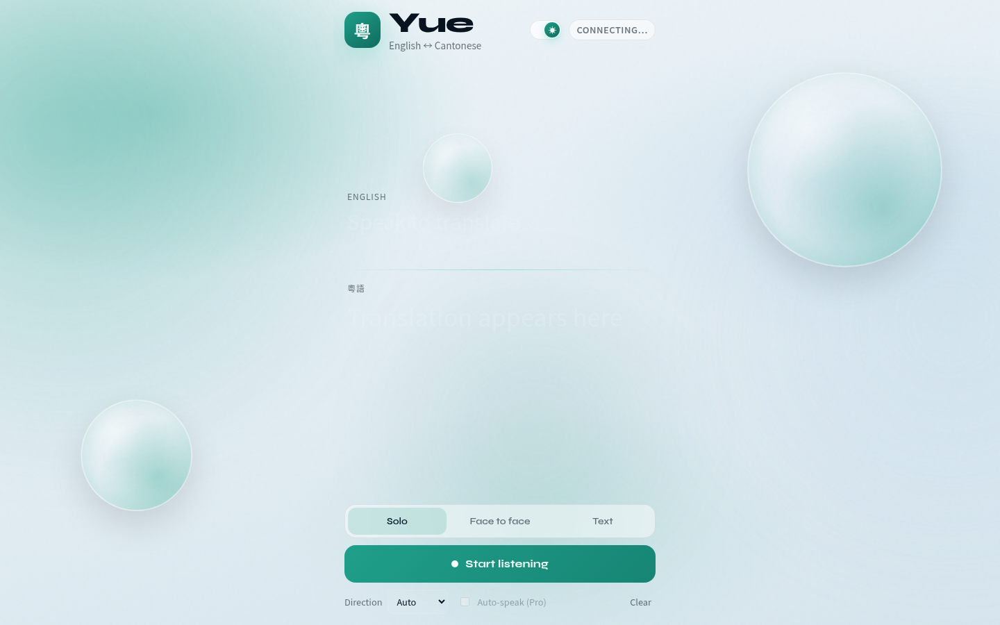
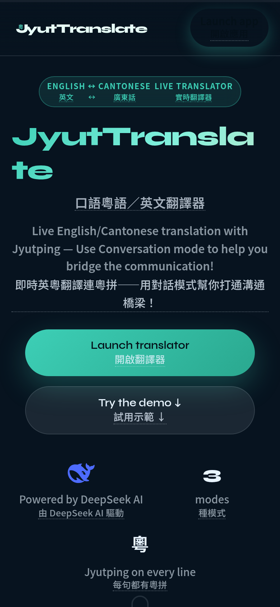
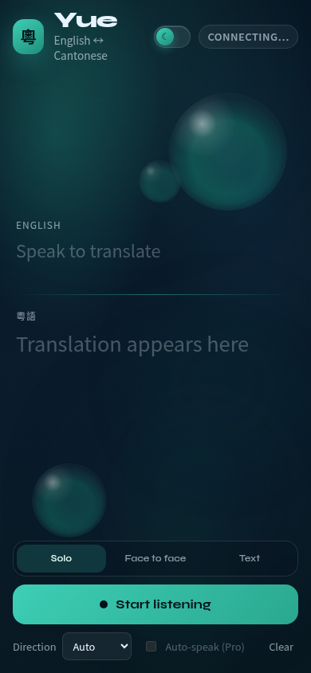
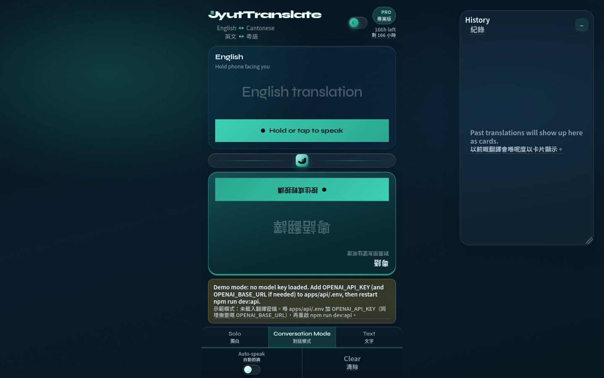
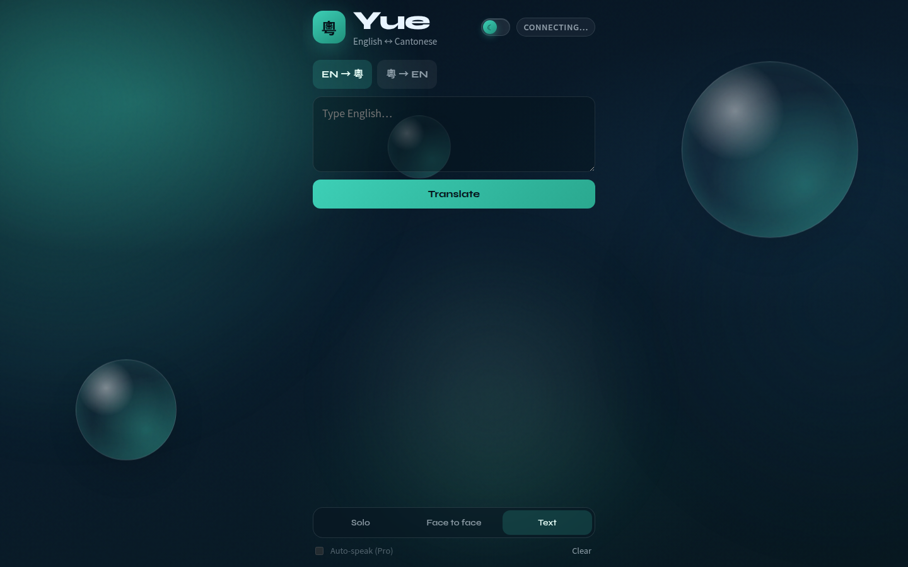

# JyutTranslate UI demos / 粤译界面演示

Fresh snapshots from the local Vite app (`npm run docs:screenshots`). Modes: **Solo**, **Conversation**, **Text**, **Cam**.

来自本地 Vite 应用的最新截图（`npm run docs:screenshots`）。模式：**独白**、**对话**、**文字**、**相机**。

| # | Screen / 画面 | Preview / 预览 |
| --- | --- | --- |
| 1 | Landing — dark / 首页 — 深色 |  |
| 2 | Landing — light / 首页 — 浅色 |  |
| 3 | Pricing — dark / 定价 — 深色 |  |
| 4 | Translator Solo — dark / 独白翻译 — 深色 |  |
| 5 | Translator Solo — light / 独白翻译 — 浅色 |  |
| 6 | Landing mobile — dark / 首页手机 — 深色 |  |
| 7 | Translator mobile — dark / 翻译器手机 — 深色 |  |
| 8 | Conversation — dark / 对话 — 深色 |  |
| 9 | Text mode — dark / 文字模式 — 深色 |  |

Desktop viewport: 1440×900 · Mobile: 390×844 @2x.

桌面视口：1440×900 · 手机：390×844 @2x。

Refresh after UI changes / 界面改动后刷新：

```bash
npm run dev:web   # already running is fine / 已在运行亦可
npm run docs:screenshots
```
