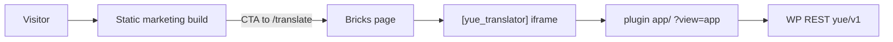

# Hybrid marketing + Bricks translator (Bluehost)

Recommended launch shape: **static marketing files** for the brand site, and a **Bricks (or WP) page** with `[yue_translator]` for the product.



`[yue_splash]` is optional when marketing is hosted as real static files.

## 1. Build

```bash
# Marketing upload (apps/web/dist → paste onto Bluehost)
npm run build:web:marketing

# Plugin app assets (wordpress/yue-translator/app/)
npm run build:web:wp
```

Both builds include `site-config.json` next to `index.html`.

## 2. Upload marketing static files

Copy `dist-marketing/` (or `apps/web/dist/`) into a Bluehost directory, for example:

- Subdirectory: `public_html/welcome/`
- Or a subdomain document root

WordPress **Settings → Reading → Homepage** only picks a WP page. To make static files “the landing page”:

1. Put the build in a folder/subdomain, then redirect `/` to it, **or**
2. Make the WP homepage a thin redirect/link into that folder

Do **not** overwrite WordPress’s root `index.php` unless you know how WP routing works.

## 3. Point CTAs at the Bricks translator page

Edit `site-config.json` **on the server** (no rebuild required):

```json
{
  "translatorUrl": "https://yoursite.com/translate",
  "pricingUrl": "https://yoursite.com/pricing",
  "marketingUrl": "https://yoursite.com/welcome/"
}
```

| Field | Purpose |
| --- | --- |
| `translatorUrl` | Bricks page that embeds `[yue_translator]` |
| `pricingUrl` | Pricing / MemberPress checkout |
| `marketingUrl` | Optional back-link to the static marketing site |

Leave a field empty to keep in-app hash routes (`#/app`, `#/pricing`) — useful for local `npm run dev:web`.

You can also bake URLs at build time via `apps/web/.env` (`VITE_TRANSLATOR_URL`, etc.); query params `?translator=` / `?pricing=` override for testing.

## 4. WordPress plugin + Bricks page

1. Upload `wordpress/yue-translator/` to `wp-content/plugins/`.
2. Activate **JyutTranslate** and set Azure/OpenAI keys.
3. Set **Upgrade URL** to the same checkout URL as `pricingUrl`.
4. Create a Bricks page (e.g. `/translate`) and place `[yue_translator]`.

The shortcode iframe forces `?view=app` so visitors see the translator, not the marketing routes.

## What you maintain

| Piece | When to refresh |
| --- | --- |
| Static marketing folder | Landing redesign → `npm run build:web:marketing` and re-upload |
| Plugin `app/` | Translator UI changes → `npm run build:web:wp` and re-upload plugin |
| Bricks page | Layout chrome around the shortcode only |
| `site-config.json` | URL changes on the static host |

See also [bluehost-launch.md](./bluehost-launch.md) for entitlements and API keys.
